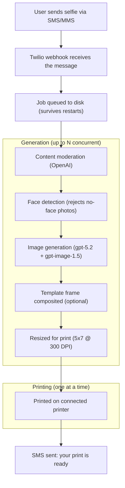

# Twilio Cartoon Printer

A photobooth-style app powered by Twilio and OpenAI. Attendees text a selfie to a Twilio phone number, choose an art style, and get a printed portrait at your booth.

## How It Works



Users pick an art style by typing the name in the same message as their selfie:

| Style | Description |
|---|---|
| **cartoon** (default) | 3D animated film style |
| **pop art** | Bold Warhol/Lichtenstein style |
| **watercolor** | Soft watercolor painting |
| **anime** | Japanese anime illustration |
| **sketch** | Graphite pencil drawing |
| **pixel art** | Retro 16-bit video game style |

If no style is specified, it defaults to cartoon.

## Prerequisites

- **Node.js** v18+
- **pnpm** -- install with `npm install -g pnpm` ([docs](https://pnpm.io/installation))
- **Twilio account** with a phone number that has SMS/MMS enabled
- **OpenAI API key** with access to gpt-5.2 and gpt-image-1.5
- **Printer** configured on the system and accessible via `lp` (macOS/Linux CUPS)

## Quick Start

### 1. Clone and install

```sh
git clone <your-repo-url>
cd twilio-cartoon-printer
pnpm install
```

### 2. Configure environment

Copy the example below into a `.env` file in the project root:

```sh
# Twilio credentials (from https://console.twilio.com)
TWILIO_ACCOUNT_SID=your_account_sid
TWILIO_AUTH_TOKEN=your_auth_token

# OpenAI API key (from https://platform.openai.com/api-keys)
OPENAI_API_KEY=your_openai_key

# Printer name (run `lpstat -p` to list available printers)
PRINTER_NAME=your_printer_name

# Event config
EVENT_NAME=YourEventName
ADMIN_PHONES=+1234567890,+0987654321
MAX_PRINTS_PER_USER=2
MAX_CONCURRENT_GENERATION=5

# Template frame (optional -- leave blank to disable)
TEMPLATE_FILE=signal_sf.png

# Legal
TERMS_URL=https://example.com/terms

# Promotional message (optional -- leave blank to disable)
PROMO_EVENT_NAME=SIGNAL San Francisco
PROMO_EVENT_DATE=May 6-7, 2026
PROMO_EVENT_URL=https://twil.io/devweek26
```

| Variable | Required | Description |
|---|---|---|
| `TWILIO_ACCOUNT_SID` | Yes | Your Twilio Account SID |
| `TWILIO_AUTH_TOKEN` | Yes | Your Twilio Auth Token |
| `OPENAI_API_KEY` | Yes | Your OpenAI API key |
| `PRINTER_NAME` | Yes | CUPS printer name prefix (find with `lpstat -p`). The app matches any printer starting with this name, so `EPSON_ET_8550_Series` matches `EPSON_ET_8550_Series_2`, etc. |
| `EVENT_NAME` | Yes | Name of the current event (used for per-event print limits and download folders) |
| `ADMIN_PHONES` | No | Comma-separated phone numbers in E.164 format (e.g. `+14155551234`). Admins get unlimited prints and are excluded from dashboard metrics. |
| `MAX_PRINTS_PER_USER` | No | Max free prints per phone number per event. Defaults to `2`. |
| `MAX_CONCURRENT_GENERATION` | No | Max AI image generations running at the same time. Defaults to `3`. Increase for faster throughput, decrease if hitting OpenAI rate limits. |
| `TEMPLATE_FILE` | No | Filename of the template frame in the `templates/` folder (e.g. `signal_sf.png`). Leave blank to disable. |
| `TERMS_URL` | No | URL to your terms of service. Shown once in the user's first selfie confirmation. |
| `PROMO_EVENT_NAME` | No | Name of the event to promote in SMS messages |
| `PROMO_EVENT_DATE` | No | Date string for the promoted event |
| `PROMO_EVENT_URL` | No | Registration URL for the promoted event |

### 3. Template frame (optional)

Place your template PNGs in the `templates/` folder. Set `TEMPLATE_FILE` in `.env` to the filename you want to use (e.g. `signal_sf.png`). To switch templates, just change the env variable and restart.

Templates should be PNGs with **transparent areas** where the generated portrait shows through. The opaque areas form the frame border (branding, logos, CTA, etc.). The template is composited on top of the portrait at print dimensions (1500x2100).

The template can be **any resolution** — it gets resized to fit the print automatically. For best results, use a 5:7 aspect ratio. Other ratios work too; the full frame design is preserved with transparent padding if the ratio doesn't match.

Leave `TEMPLATE_FILE` blank to disable the frame overlay.

### 4. Find your printer name

```sh
lpstat -p
```

Copy the printer name (e.g. `EPSON_ET_8550_Series`) into `PRINTER_NAME` in your `.env`. The app will match any printer starting with that name and prefer a healthy one over a disconnected/disabled one.

Print settings (page size, resolution, borderless options) are configured in `lib/printer.js`. The defaults are tuned for an Epson ET-8550 on 5x7 photo paper with no margins.

### 5. Start the server

```sh
sudo pnpm start
```

or equivalently `sudo node index.js`. `sudo` is required when using the default port 80 (needed for Twilio webhooks over HTTP). Set `PORT` in your `.env` to use a different port (e.g. `PORT=8080`).

The home page (`http://localhost:<port>/home`) opens automatically in your default browser on startup. You should see:

```
🚀 App running on port 80 | Event: YourEventName
📊 Usage cache built: 0 entries
📄 Paper counter loaded: 20/20 sheets (warn at 2)
🏠 Home page mounted at /home
📊 Dashboard mounted at /dashboard
⏱️  Workers started (polling every 3000ms, max 5 concurrent generations)
```

### 6. Connect Twilio

Point your Twilio phone number's **Messaging webhook** to your server:

```
http://your-server-ip/sms
```

You can configure this in the [Twilio Console](https://console.twilio.com) under your phone number's settings, or via the Twilio CLI. The webhook method should be `POST`.

If your server is behind a firewall or on a local network, you can use [ngrok](https://ngrok.com) to expose it:

```sh
ngrok http 80
```

Then use the ngrok URL (e.g. `https://abc123.ngrok.io/sms`) as your webhook.

## Run with Docker (local)

Build the image:

```sh
docker build -t twilio-cartoon-printer .
```

Run the container and pass your `.env` file:

```sh
docker run --rm -p 8080:8080 --env-file .env twilio-cartoon-printer
```

If your `.env` doesn't set `PORT`, add it for Docker (common choice: `8080`):

```sh
PORT=8080
```

Then point Twilio to:

```
http://<your-host>:8080/sms
```

## Web UI

The app serves two web pages on the same port:

| Route | Description |
|---|---|
| `/home` | Home page (opens automatically on startup) |
| `/dashboard` | Real-time monitoring dashboard |

## Dashboard

The monitoring dashboard is available at `http://localhost:<port>/dashboard`.

Admin phone numbers are excluded from all dashboard metrics -- they won't appear in totals, averages, top users, style breakdowns, or the outreach list.

Use the **event selector** dropdown in the header to filter all metrics by a specific event, or view combined totals across all events.

The dashboard shows:

- **Stats overview** -- total prints, prints in the last 24 hours, unique users, average prints per user, current queue depth
- **Paper counter** -- tracks remaining sheets in the printer tray with a visual progress bar. Configurable capacity and warning threshold. Alerts when paper is low or empty. Click "Reset" after reloading the tray.
- **Queue status** -- live counts for each pipeline stage (pending, generating, ready, printing)
- **Printer status** -- current state of the connected printer (idle, printing, disconnected, etc.)
- **Style breakdown** -- bar chart showing how many prints of each art style
- **Hourly activity** -- bar chart of prints per hour over the last 24 hours with hour labels and hover tooltips
- **Top users** -- most active phone numbers (masked for privacy)
- **Job health** -- completed vs failed counts, overall success rate, and content rejection rate
- **Failure breakdown** -- bar chart categorizing failures by reason (moderation, face detection, generation/API errors, printer errors)
- **User geography** -- bar chart showing where users are located based on phone number country codes
- **SMS Outreach** -- collapsible section listing every user who has generated an image (phone numbers masked, showing country code and last 4 digits). Select individual or multiple recipients and send broadcast SMS messages directly from the dashboard. Includes a "Pick a Winner" button that randomly selects a recipient for raffle prizes or giveaways.

The dashboard auto-refreshes every 3 seconds. No external dependencies -- it's a single self-contained HTML page with inline CSS and JavaScript.

### Event report

Click **Generate Report** in the dashboard header to download a PDF summarizing key event metrics. The report includes:

- AI-generated event summary (via OpenAI)
- Key metrics (total prints, unique users, avg per user, most popular style, success rate)
- Style breakdown table
- Top users
- Failure analysis with rejection rate
- User geography (top 10 countries)

The report respects the currently selected event filter. AI summaries are cached in memory so repeated downloads don't re-call the API.

### Paper counter

The paper counter is software-based. It decrements automatically each time a print completes. Since printers don't report exact sheet counts for photo paper trays, this tracks it for you.

- Default capacity: 20 sheets, warning at 2 remaining
- Both values are adjustable from the dashboard
- Console logs warnings when paper is low (`⚠️`) or empty (`🚨`)
- State persists across server restarts (saved to `data/paper.json`)

## Project Structure

```
twilio-cartoon-printer/
├── index.js              Express app, Twilio webhook, server startup
├── lib/
│   ├── config.js         Shared constants, paths, API clients
│   ├── styles.js         Art style definitions and prompts
│   ├── helpers.js        Image download, SMS, moderation, face detection, compositing
│   ├── printer.js        Printer discovery and print commands
│   ├── pipeline.js       generateImage (steps 1-6) and printJob (steps 7-8)
│   ├── queue.js          Concurrent generation worker, serial print worker, usage tracking
│   ├── dashboard.js      Real-time dashboard (mounted at /dashboard)
│   ├── home.js           Home page (mounted at /home)
│   └── paper.js          Paper counter with file persistence
├── templates/            Frame overlays (PNGs with transparent center)
│   └── signal_sf.png     Example: SIGNAL SF branded frame
├── downloads/            Generated images, organized by event name
│   └── YourEventName/
│       ├── 20260211_143000_input.jpg
│       └── 20260211_143000_output.png
├── queue/                File-based job queue
│   ├── pending/          New jobs waiting for generation
│   ├── generating/       Jobs currently generating AI images (up to N concurrent)
│   ├── ready/            Generation complete, waiting to print
│   ├── printing/         Job currently being printed
│   ├── done/             Successfully printed jobs
│   └── failed/           Permanent failures or max retries exceeded
├── data/                 Persistent app data
│   └── paper.json        Paper counter state
├── .env                  API keys, printer config, event settings
├── .gitignore            Excludes downloads/, queue/, .env, node_modules/
├── package.json
└── pnpm-lock.yaml
```

## Job Queue

Jobs are managed entirely via the filesystem -- no database or Redis required.

Job files, input photos, and output photos all share the same timestamp prefix so you can easily match them:

```
queue/done/20260211_143000.json
downloads/YourEventName/20260211_143000_input.jpg
downloads/YourEventName/20260211_143000_output.png
```

The pipeline is split into two independent workers:

- **Generation worker** -- Processes up to `MAX_CONCURRENT_GENERATION` jobs at the same time. Each job goes through download, moderation, face detection, AI generation, compositing, and print prep. Multiple images generate in parallel so users don't wait in a long single-threaded queue.
- **Print worker** -- Processes one job at a time from the `ready/` queue. Sends the image to the printer and notifies the user via SMS when their print is ready.

### Crash recovery

On server restart:

- Jobs in `generating/` are recovered. If the output image already exists on disk, the job skips straight to `ready/` (no re-generation). Otherwise it goes back to `pending/` for retry.
- Jobs in `printing/` are moved back to `ready/` (the image exists, just retry the print).
- Non-permanent jobs in `failed/` are recovered automatically -- routed to `ready/` or `pending/` depending on whether the output image exists.

### Permanent failures

Jobs flagged by content moderation or rejected by face detection are moved directly to `failed/` without retrying. The user's print count is refunded and they're told it didn't cost a print. Each failed job records a `failReason` field (`moderation`, `face_detection`, `generation`, `printer`) used by the dashboard's failure breakdown panel.

### Retry logic

Failed jobs retry up to 3 times. Each pipeline step is skipped on retry if its output already exists on disk, so only the failed step re-runs.

## Adding or Changing Styles

Art styles are defined in `lib/styles.js`. Each style has a keyword, display name, and an LLM prompt. To add a new style, add an entry to the `STYLES` object:

```js
"oil-painting": {
    name: "oil painting",
    prompt: "Transform this photo into a classical oil painting portrait..."
},
```

The style will automatically appear in SMS messages and be available for users to select. Style matching is fuzzy -- it handles extra spaces, hyphens, and case differences.

## Promotional Messages

The app can append a promotional message to SMS confirmations. Promo messages escalate based on user interaction:

- **First selfie** -- Soft intro: *"P.S. Join us at SIGNAL San Francisco..."*
- **Returning user** -- Nudge: *"Have you registered for SIGNAL San Francisco yet?..."*

To disable promos, leave `PROMO_EVENT_NAME` and `PROMO_EVENT_URL` blank in `.env`.

## Switching Events

When moving to a new event:

1. Update `EVENT_NAME` in `.env` -- this resets everyone's print count and creates a new downloads subfolder.
2. Update `PROMO_*` variables if promoting a different event.
3. Optionally update `TEMPLATE_FILE` in `.env` with new event branding.
4. Restart the server.

Previous event data (downloads, completed jobs) is preserved on disk.
