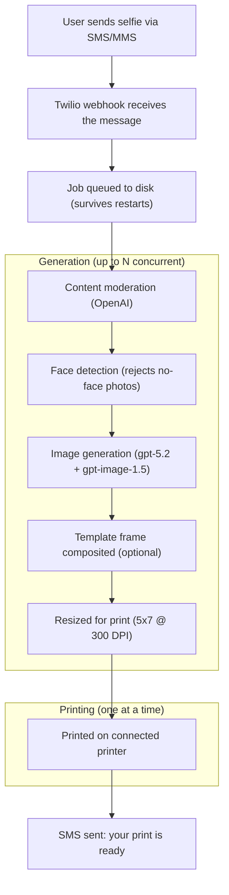

# Twilio + AI Photo Generator

A photobooth-style app powered by Twilio and OpenAI. Attendees text a selfie to a Twilio phone number, choose an art style, and get a printed portrait at your booth. All configuration is manageable at runtime through a web-based admin UI -- no server restarts needed.

## How It Works



After sending a selfie, users receive a numbered style menu:

```
Great selfie! Pick your art style:

1. cartoon
2. pop art
3. watercolor
4. anime
5. sketch
6. pixel art

Reply with a number or style name.
```

Users can reply with a number (`3`) or type the style name (`watercolor`). If a user includes a recognized style name in the caption when sending their selfie, the menu is skipped and generation starts immediately.

If no style is specified, the default style is used (cartoon by default, configurable from the Settings panel).

The bot also responds conversationally when users send text-only messages with questions or unusual input (e.g. "what is twilio?", "how does this work?"). Common short messages like "hi" get a fast static response, while longer or more interesting messages get a dynamic AI-generated reply (via gpt-4o-mini) that answers the question and directs the user to send a selfie.

## Prerequisites

- **Node.js** v18+
- **pnpm** -- install with `npm install -g pnpm` ([docs](https://pnpm.io/installation))
- **Twilio account** with a phone number that has SMS/MMS enabled
- **OpenAI API key** with access to gpt-5.2 and gpt-image-1.5
- **Printer** -- Epson EcoTank ET-8550 recommended. Connected via USB, WiFi, or Bonjour and registered in CUPS (macOS/Linux). See [Printer setup](#4-printer-setup) for details.

## Quick Start

### 1. Clone and install

```sh
git clone <your-repo-url>
cd twilio-cartoon-printer
pnpm install
```

### 2. Configure environment

Copy the example below into a `.env` file in the project root:

```sh
# Twilio credentials (from https://console.twilio.com)
TWILIO_ACCOUNT_SID=your_account_sid
TWILIO_AUTH_TOKEN=your_auth_token

# OpenAI API key (from https://platform.openai.com/api-keys)
OPENAI_API_KEY=your_openai_key

# Printer name (run `lpstat -p` to list available printers)
PRINTER_NAME=your_printer_name

# Event config
EVENT_NAME=YourEventName
ADMIN_PHONES=+1234567890,+0987654321
MAX_PRINTS_PER_USER=2
MAX_CONCURRENT_GENERATION=5

# Template frame (optional -- leave blank to disable)
TEMPLATE_FILE=signal_sf.png

# Get Started video (optional -- filename in assets/ folder)
VIDEO_FILE=get-started.mp4

# Legal
TERMS_URL=https://example.com/terms

# Delivery mode (optional -- set to "false" to disable printing)
ENABLE_PRINTING=true

# Print settings (optional -- all configurable from Settings panel at runtime)
PRINT_SIZE=5x7
PRINT_QUALITY=high
CUSTOM_PRINT_FLAGS=

# Brand prompt (optional -- appended to every art style prompt)
BRAND_PROMPT=

# Promotional message (optional -- leave blank to disable)
PROMO_EVENT_NAME=SIGNAL San Francisco
PROMO_EVENT_DATE=May 6-7, 2026
PROMO_EVENT_URL=https://twil.io/devweek26
```

| Variable | Required | Description |
|---|---|---|
| `TWILIO_ACCOUNT_SID` | Yes | Your Twilio Account SID |
| `TWILIO_AUTH_TOKEN` | Yes | Your Twilio Auth Token |
| `OPENAI_API_KEY` | Yes | Your OpenAI API key |
| `PRINTER_NAME` | Yes | CUPS printer name prefix (find with `lpstat -p`). The app matches any printer starting with this name, so `EPSON_ET_8550_Series` matches `EPSON_ET_8550_Series_2`, etc. |
| `EVENT_NAME` | Yes | Name of the current event (used for per-event print limits and download folders) |
| `ADMIN_PHONES` | No | Comma-separated phone numbers in E.164 format (e.g. `+14155551234`). Admins get unlimited prints and are excluded from dashboard metrics. |
| `MAX_PRINTS_PER_USER` | No | Max free prints per phone number per event. Defaults to `2`. |
| `MAX_CONCURRENT_GENERATION` | No | Max AI image generations running at the same time. Defaults to `3`. Increase for faster throughput, decrease if hitting OpenAI rate limits. |
| `TEMPLATE_FILE` | No | Filename of the template frame in the `templates/` folder (e.g. `signal_sf.png`). Leave blank to disable. |
| `VIDEO_FILE` | No | Filename of the Get Started video in the `assets/` folder (e.g. `get-started.mp4`). Defaults to `get-started.mp4`. |
| `TERMS_URL` | No | URL to your terms of service. Shown once in the user's first selfie confirmation. |
| `ENABLE_PRINTING` | No | Set to `false` to disable printing and run digital-only (MMS delivery). Defaults to `true`. |
| `BRAND_PROMPT` | No | Global branding prompt appended to every art style (e.g. clothing, logos). Leave blank to disable. |
| `PRINT_SIZE` | No | Print paper size. Options: `4x6`, `5x7`, `8x10`. Defaults to `5x7`. Controls both image pixel dimensions and the PageSize flag sent to the printer. |
| `PRINT_QUALITY` | No | Print resolution. Options: `standard` (360 DPI), `high` (720 DPI), `max` (1440 DPI). Defaults to `high`. |
| `CUSTOM_PRINT_FLAGS` | No | Additional raw flags appended to the `lp` command. For non-Epson printers or advanced CUPS options (e.g. `-o MediaType=Glossy`). |
| `PROMO_EVENT_NAME` | No | Name of the event to promote in SMS messages |
| `PROMO_EVENT_DATE` | No | Date string for the promoted event |
| `PROMO_EVENT_URL` | No | Registration URL for the promoted event |

### 3. Template frame (optional)

Place your template PNGs in the `templates/` folder. Set `TEMPLATE_FILE` in `.env` to the filename you want to use (e.g. `signal_sf.png`). You can also change the template at runtime from the Settings panel on the home page, and upload new templates directly through the UI.

Templates should be PNGs with **transparent areas** where the generated portrait shows through. The opaque areas form the frame border (branding, logos, CTA, etc.). The template is composited on top of the portrait at print dimensions (1500x2100).

The app automatically detects the template's transparent window and fits the portrait within it, so frame borders never clip the subject's head or body. A small inset padding keeps the portrait from touching the frame edge. If no transparent area is found, the portrait fills the entire print area as a fallback.

The template can be **any resolution** — it gets resized to fit the print automatically. For best results, use a 5:7 aspect ratio. Other ratios work too; the full frame design is preserved with transparent padding if the ratio doesn't match.

Leave `TEMPLATE_FILE` blank to disable the frame overlay.

### 4. Printer setup

#### Compatible printers

The app is built and tested with the **Epson EcoTank ET-8550** wide-format photo printer. The print command options (page size, margins, resolution) in `lib/printer.js` are Epson-specific. Other Epson EcoTank models that support 5x7 borderless photo printing should also work.

Using a non-Epson printer (Canon, HP, Brother, etc.) requires changing the `-o` flags in the `lp` command in `lib/printer.js` to match that printer's supported options.

#### Connection methods

The app prints through **CUPS** (Common Unix Printing System), which is built into macOS and Linux. Any printer that appears in CUPS works, regardless of how it's connected:

- **USB** -- direct connection, most reliable
- **WiFi / Network** -- printer and server on the same network
- **Bonjour / AirPrint** -- automatic discovery on local networks (common for macOS)
- **IPP** (Internet Printing Protocol) -- standard network printing

All connection methods behave identically from the app's perspective. The `lp` command sends jobs to the CUPS daemon, which handles the connection details. A WiFi-connected Epson ET-8550 works the same as a USB-connected one.

#### Find your printer name

```sh
lpstat -p
```

Copy the printer name (e.g. `EPSON_ET_8550_Series`) into `PRINTER_NAME` in your `.env`. The app matches any printer starting with that prefix. If multiple printers match, it picks a healthy one over a disconnected or disabled one.

Print settings (page size, resolution, borderless options) are configured in `lib/printer.js`. The defaults are tuned for an Epson ET-8550 on 5x7 photo paper with no margins.

### 5. Start the server

```sh
sudo pnpm start
```

or equivalently `sudo node index.js`. `sudo` is required when using the default port 80 (needed for Twilio webhooks over HTTP). Set `PORT` in your `.env` to use a different port (e.g. `PORT=8080`).

The home page (`http://localhost:<port>/home`) opens automatically in your default browser on startup. You should see:

```
⚙️  Settings loaded (using .env defaults)
🚀 App running on port 80 | Event: YourEventName
📊 Usage cache built: 0 entries
📄 Paper counter loaded: 20/20 sheets (warn at 2)
🏠 Home page mounted at /home
📖 Photo book mounted at /photogallery
📊 Dashboard mounted at /dashboard
📨 Outreach mounted at /outreach
⏱️  Workers started (polling every 3000ms, max 5 concurrent generations)
```

### 6. Connect Twilio

Point your Twilio phone number's **Messaging webhook** to your server:

```
http://your-server-ip/sms
```

You can configure this in the [Twilio Console](https://console.twilio.com) under your phone number's settings, or via the Twilio CLI. The webhook method should be `POST`.

If your server is behind a firewall or on a local network, you can use [ngrok](https://ngrok.com) to expose it:

```sh
ngrok http 80
```

Then use the ngrok URL (e.g. `https://abc123.ngrok.io/sms`) as your webhook.

## Run with Docker (local)

Build the image:

```sh
docker build -t twilio-cartoon-printer .
```

Run the container and pass your `.env` file:

```sh
docker run --rm -p 8080:8080 --env-file .env twilio-cartoon-printer
```

If your `.env` doesn't set `PORT`, add it for Docker (common choice: `8080`):

```sh
PORT=8080
```

Then point Twilio to:

```
http://<your-host>:8080/sms
```

## Web UI

The app serves web pages on the same port:

| Route | Description |
|---|---|
| `/home` | Home page (opens automatically on startup) |
| `/home/video` | Get Started video player (fullscreen, looping) |
| `/home/combo` | Booth display -- split-screen with intro video and photo book |
| `/photogallery` | Photo book with realistic page-turn animations |
| `/dashboard` | Admin dashboard with real-time monitoring |
| `/outreach` | Outreach -- broadcast messages, raffles, lead capture reports |

### Home page

The home page at `/home` is the admin console for booth operators. It provides three action cards:

- **Launch Booth Display** -- opens a split-screen view (`/home/combo`) with the intro video and photo book side by side. The divider is draggable to resize each pane. An expandable "Open individually" section provides direct links to the intro video and photo book separately.
- **Open Dashboard** -- links to the admin dashboard for monitoring and management
- **Outreach** -- links to the dedicated outreach page for broadcast messaging, raffles, and lead capture reports

The home page also includes a collapsible **Settings** panel where admins can configure all app settings at runtime without editing `.env` or restarting the server. See the [Runtime Settings](#runtime-settings) section below for details.

A **How It Works** section shows the 6-step flow from setup through attendee engagement.

### Get Started video

The intro video at `/home/video` is a fullscreen looping video player designed to run on a booth display monitor to attract attendees and show them how the photobooth works.

- Place your video file in the `assets/` folder (or upload via the Settings panel)
- Set `VIDEO_FILE` in `.env` to the filename (defaults to `get-started.mp4`)
- The video autoplays on loop with a floating Pause/Play button and Fullscreen button
- To switch videos, change the setting from the Settings panel on `/home` or update `.env`

### Booth display

The booth display at `/home/combo` is a split-screen view combining the intro video and photo book side by side on a single monitor. The divider between panes is draggable to resize each side.

### Photo book

The photo book at `/photogallery` presents AI-generated portraits as an open book with two pages side by side. Uses the [turn.js](https://github.com/nickmilo/turn.js) library for realistic page-turn animations. Designed for a tactile, physical feel on booth displays.

- Open book layout with left and right pages showing different portraits
- Realistic page-turn animations powered by turn.js (drag corners or use arrows)
- Stacked page layers and book cover for a realistic book depth effect
- Per-page "View Original" buttons to reveal the original selfie
- Page numbers on each page (highest to lowest, newest to oldest)
- White photo frame mat around each image with decorative corner mounts
- Auto-rotates through spreads every 10 seconds
- Play/Pause, keyboard arrows, and clickable thumbnails for manual navigation
- Fullscreen support with responsive sizing
- Warm parchment-toned pages with subtle paper texture
- **Event filter** -- dropdown to filter portraits by event, or view all events combined. Works in both the standalone photo book and the booth display combo view.
- Live portrait counter with animated bump when new images arrive
- Polls for new images every 5 seconds

## Admin Dashboard

The admin dashboard is available at `http://localhost:<port>/dashboard`.

Admin phone numbers are excluded from all metrics -- they won't appear in totals, averages, top users, style breakdowns, or the outreach list.

Use the **event selector** dropdown in the header to filter all metrics by a specific event, or view combined totals across all events. Events are discovered from both job history and the `downloads/` directory, so any event with a folder or completed jobs appears in the dropdown.

The admin dashboard shows (in order):

- **Stats overview** -- total prints, prints in the last 24 hours, unique users, average prints per user, current queue depth
- **Generate Report** -- button to download a PDF event report (see below)
- **Style breakdown** -- bar chart showing how many prints of each art style
- **Hourly activity** -- bar chart of prints per hour over the last 24 hours with hour labels and hover tooltips
- **Top users** -- most active phone numbers (masked for privacy)
- **Job health** -- completed vs failed counts, overall success rate, and content rejection rate
- **Failure breakdown** -- bar chart categorizing failures by reason (moderation, face detection, generation/API errors, printer errors)
- **User geography** -- bar chart showing where users are located based on phone number country codes
- **Queue status** -- live counts for each pipeline stage (pending, generating, ready, printing) and printer status
- **Paper counter** -- tracks remaining sheets in the printer tray with a visual progress bar. Configurable capacity and warning threshold. Alerts when paper is low or empty. Click "Reset" after reloading the tray.

The dashboard auto-refreshes every 3 seconds. No external dependencies -- it's a single self-contained HTML page with inline CSS and JavaScript.

### Event report

Click **Generate Report** on the dashboard to download a PDF summarizing key event metrics. The report includes:

- AI-generated event summary (via OpenAI)
- Key metrics (total prints, unique users, avg per user, most popular style, success rate)
- Style breakdown table
- Top users
- Failure analysis with rejection rate
- User geography (top 10 countries)

The report respects the currently selected event filter. AI summaries are cached in memory so repeated downloads don't re-call the API.

### Paper counter

The paper counter is software-based. It decrements automatically each time a print completes. Since printers don't report exact sheet counts for photo paper trays, this tracks it for you.

- Default capacity: 20 sheets, warning at 2 remaining
- Both values are adjustable from the dashboard
- Console logs warnings when paper is low (`⚠️`) or empty (`🚨`)
- State persists across server restarts (saved to `data/paper.json`)

## Lead Capture

The app can collect attendee contact information via a short SMS survey. When enabled, each user completes a one-time survey (per event) that captures:

| # | Field | Validation |
|---|-------|------------|
| 1 | First name | Non-empty |
| 2 | Last name | Non-empty |
| 3 | Country code | 2-3 letter code (e.g. US, UK, CA) |
| 4 | Business email | Valid email, personal domains rejected (Gmail, Yahoo, Hotmail, etc.) |
| 5 | Company | Non-empty |
| 6 | Job title | Non-empty |

### Modes

Configure Lead Capture Mode from the Settings panel on `/home`:

- **Disabled** (default) -- No survey, normal flow
- **Before** -- Survey runs when a user first texts the app. If they sent a selfie, it's held and auto-enqueued after survey completion. If they texted without an image, they're prompted to send a selfie after finishing.
- **After** -- Normal flow proceeds (selfie, generation, printing). When the portrait is ready, the completion MMS is held back and the survey starts. After completion, the held MMS is delivered along with a confirmation summary.

The survey only runs once per user per event. Admin phone numbers always skip the survey. Leads persist to `data/leads.json` and survive server restarts. In-memory survey state (active conversations) is lost on restart, but the user's next message will restart the survey if their lead hasn't been saved yet.

### Lead reports

The Outreach page (`/outreach`) includes a Lead Capture panel that shows captured leads for the selected event. Admins can download a CSV export with all survey fields plus the phone number and capture date.

## Outreach

The Outreach page at `/outreach` is a dedicated tool for engaging attendees after they've used the photobooth. It's accessible from the home page and provides a focused workflow separate from the monitoring-oriented dashboard.

Features:

- **User directory** -- lists every attendee who has generated an image, with masked phone numbers, print counts, art styles used, and time since last activity
- **Event filtering** -- dropdown to filter users by event, matching the dashboard's event selector
- **Broadcast messaging** -- select individual users or "Select All", compose a message, and send SMS to all selected recipients at once
- **Raffle system** -- "Draw Winner" button with an animated random selection that highlights users in sequence before landing on a winner. Winners are automatically persisted to `data/raffle.json` and marked with a trophy icon in the user list
- **Raffle history** -- scrollable list of past raffle winners with timestamps, persisted across server restarts
- **Lead Capture** -- panel showing captured leads for the selected event with a CSV download button for exporting lead data
- **Stat cards** -- at-a-glance counts for total recipients, currently selected, raffle winners drawn, and leads captured

The page uses a two-column layout on desktop (user list on the left, actions on the right) and stacks to a single column on mobile. It auto-refreshes the user list every 10 seconds.

## Project Structure

```
twilio-cartoon-printer/
├── index.js              Express app, Twilio webhook, server startup
├── lib/
│   ├── config.js         Static constants, paths, API clients
│   ├── settings.js       Runtime mutable settings (persists to data/settings.json)
│   ├── styles.js         Art style definitions and prompts
│   ├── helpers.js        Image download, SMS, moderation, face detection, compositing, AI smart replies
│   ├── style-menu.js     Style selection menu after selfie (numbered list, pending state)
│   ├── printer.js        Printer discovery and print commands
│   ├── pipeline.js       generateImage (steps 1-6) and printJob (steps 7-8)
│   ├── queue.js          Concurrent generation worker, serial print worker, usage tracking
│   ├── dashboard.js      Admin dashboard (mounted at /dashboard)
│   ├── home.js           Home page, settings panel, intro video, booth display (mounted at /home)
│   ├── leads.js          Lead capture SMS survey engine and persistence
│   ├── outreach.js       Outreach -- broadcast messaging, raffles, lead reports (mounted at /outreach)
│   ├── photogallery.js   Photo book (mounted at /photogallery)
│   └── paper.js          Paper counter with file persistence
├── assets/               Video and media files for the home page
│   └── get-started.mp4   Attract loop video (gitignored)
├── templates/            Frame overlays (PNGs with transparent center)
│   └── signal_sf.png     Example: SIGNAL SF branded frame
├── downloads/            Generated images, organized by event name
│   └── YourEventName/
│       ├── 20260211_143000_input.jpg
│       └── 20260211_143000_output.png
├── queue/                File-based job queue
│   ├── pending/          New jobs waiting for generation
│   ├── generating/       Jobs currently generating AI images (up to N concurrent)
│   ├── ready/            Generation complete, waiting to print
│   ├── printing/         Job currently being printed
│   ├── done/             Successfully printed jobs
│   └── failed/           Permanent failures or max retries exceeded
├── data/                 Persistent app data
│   ├── leads.json        Captured leads (keyed by phone:event)
│   ├── paper.json        Paper counter state
│   ├── raffle.json       Raffle winner history
│   └── settings.json     Runtime settings overrides
├── .env                  API keys, printer config, event settings
├── .gitignore            Excludes downloads/, queue/, .env, node_modules/
├── package.json
└── pnpm-lock.yaml
```

## Job Queue

Jobs are managed entirely via the filesystem -- no database or Redis required.

Job files, input photos, and output photos all share the same timestamp prefix so you can easily match them:

```
queue/done/20260211_143000.json
downloads/YourEventName/20260211_143000_input.jpg
downloads/YourEventName/20260211_143000_output.png
```

The pipeline is split into two independent workers:

- **Generation worker** -- Processes up to `MAX_CONCURRENT_GENERATION` jobs at the same time. Each job goes through download, moderation, face detection, AI generation, compositing, and print prep. Multiple images generate in parallel so users don't wait in a long single-threaded queue.
- **Print worker** -- Processes one job at a time from the `ready/` queue. Sends the image to the printer and notifies the user via SMS when their print is ready.

### Crash recovery

On server restart:

- Jobs in `generating/` are recovered. If the output image already exists on disk, the job skips straight to `ready/` (no re-generation). Otherwise it goes back to `pending/` for retry.
- Jobs in `printing/` are moved back to `ready/` (the image exists, just retry the print).
- Non-permanent jobs in `failed/` are recovered automatically -- routed to `ready/` or `pending/` depending on whether the output image exists.

### Permanent failures

Jobs flagged by content moderation or rejected by face detection are moved directly to `failed/` without retrying. The user's print count is refunded and they're told it didn't cost a print. Each failed job records a `failReason` field (`moderation`, `face_detection`, `generation`, `printer`) used by the dashboard's failure breakdown panel.

### Retry logic

Failed jobs retry up to 3 times. Each pipeline step is skipped on retry if its output already exists on disk, so only the failed step re-runs.

## Adding or Changing Styles

Art styles can be managed in two ways:

**From the Settings panel** (no code changes): Open the Settings panel on `/home`, scroll to the Art & Branding section. You can toggle built-in styles on/off, edit their prompts (with a reset button to revert to the original), add custom styles with a name and prompt, and edit custom style names and prompts after creation. You can also choose which style is used as the default when a user doesn't specify one. All customizations are stored in `data/settings.json`.

**In code**: Built-in styles are defined in `lib/styles.js`. Each style has a keyword, display name, and an LLM prompt. To add a new built-in style, add an entry to the `STYLES` object:

```js
"oil-painting": {
    name: "oil painting",
    prompt: "Transform this photo into a classical oil painting portrait..."
},
```

Styles automatically appear in SMS messages and are available for users to select. Style matching is fuzzy -- it handles extra spaces, hyphens, and case differences.

## Brand Prompt

The brand prompt is a global modifier appended to every art style's AI prompt. Use it for event-specific branding that should appear across all styles -- clothing, logos, visual themes, etc.

For example, setting the brand prompt to "The subject should be wearing a bright red Twilio t-shirt with the Twilio logo clearly visible" will apply that branding to cartoon, watercolor, anime, and every other style.

Configure it from the Settings panel under Art & Branding. Leave blank to disable. Can also be set via the `BRAND_PROMPT` environment variable.

## Delivery Mode

The app supports two delivery modes, configurable from the Settings panel under Booth & Delivery:

- **Print + Digital** (default) -- Portraits are printed at the booth and sent to the user via MMS after printing completes. Requires a connected printer.
- **Digital Only** -- Portraits are sent via MMS immediately after AI generation. No printer required. Use this for demos, remote events, or setups without a physical printer.

Can also be set via the `ENABLE_PRINTING` environment variable (`true` or `false`).

## Promotional Messages

The app can append a promotional message to SMS confirmations. Two separate messages can be configured, one for first-time users and one for returning users:

- **First selfie (Intro)** -- Appended to the first confirmation SMS for a new user
- **Returning user** -- Appended to subsequent confirmation SMS messages

Promo messages can be edited from the Settings panel on the home page under Messaging. The `.env` variables `PROMO_EVENT_NAME`, `PROMO_EVENT_DATE`, and `PROMO_EVENT_URL` are used to compute default promo text if no override is set. Leave the promo text fields blank to disable.

## Runtime Settings

The Settings panel on the home page (`/home`) lets admins change all app configuration at runtime without editing `.env` or restarting the server. Changes take effect immediately and are persisted to `data/settings.json`.

The settings panel is organized into five sections:

**Event** -- Event Name, Max Prints Per User, Max Concurrent Generations

**Lead Capture** -- Lead Capture Mode (Disabled, Before, or After). See [Lead Capture](#lead-capture) for details.

**Art & Branding** -- Default Style selector, Brand Prompt (global branding applied to all styles), art style toggles with editable prompts (and reset for built-ins), custom style creation with editable names and prompts

**Booth & Delivery** -- Delivery Mode (Print + Digital or Digital Only), Printer selection, Print Size (4x6, 5x7, 8x10), Print Quality (Standard, High, Max), Custom Print Flags, Template Frame, Intro Video. Print settings are only visible when Print + Digital mode is selected and take effect on the next print job.

**Messaging** -- Admin Phone Numbers, Terms URL, First-Time and Returning User promo messages

Settings are stored as overrides on top of `.env` defaults. Click "Reset to Defaults" to revert all overrides.

The settings API is also available programmatically:

- `GET /dashboard/api/settings` -- current settings
- `POST /dashboard/api/settings` -- update settings
- `POST /dashboard/api/settings/reset` -- revert to `.env` defaults
- `GET /dashboard/api/settings/files` -- list available templates, videos, printers
- `POST /dashboard/api/settings/upload?type=template&filename=foo.png` -- upload a file

## Switching Events

When moving to a new event, change the Event Name in the Settings panel on `/home`. This automatically:

1. Creates a new downloads subfolder for the event
2. Resets everyone's print count
3. Takes effect immediately -- no restart needed

You can also update the promo messages and template frame from the same panel. Previous event data (downloads, completed jobs) is preserved on disk.
