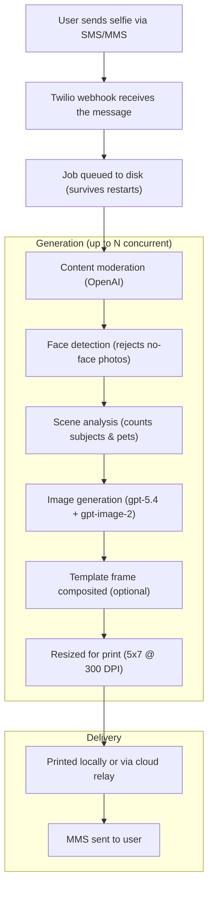

# Twilio + AI Photo Generator

A photobooth-style app powered by Twilio and OpenAI. Attendees text a selfie to a Twilio phone number, choose an art style, and receive a printed portrait at your booth (or a digital copy via MMS). All configuration is manageable at runtime through a web-based admin UI -- no server restarts needed.

## How It Works



After sending a selfie, users receive a numbered style menu and reply with a number or style name. The bot also responds conversationally to questions via AI. All SMS messages are fully configurable from the admin Settings panel at runtime.

## Deployment Options

| Mode | Server runs | Printer | Best for |
|------|------------|---------|----------|
| **Local** | On your laptop | USB/WiFi connected directly | Simple booth setup |
| **Cloud (digital only)** | Cloud (Azure, Docker, etc.) | None needed | Remote/virtual events |
| **Cloud + Print Station app** | Cloud | Local laptop at event | Large events, persistent data |

See [Quick Start](#quick-start) for local setup, or [Cloud Deployment](#cloud-deployment) for hosting in the cloud.

## Prerequisites

- **Node.js** v18+
- **pnpm** -- install with `npm install -g pnpm` ([docs](https://pnpm.io/installation))
- **Twilio account** with a phone number that has SMS/MMS enabled
- **OpenAI API key** with access to gpt-5.4 and gpt-image-2
- **Printer** (optional) -- Epson EcoTank ET-8550 recommended, connected via USB/WiFi and registered in CUPS

## Quick Start

### 1. Clone and install

```sh
git clone <your-repo-url>
cd twilio-cartoon-printer
pnpm install
```

### 2. Configure environment

Copy `.env.example` to `.env` and fill in your credentials:

```sh
cp .env.example .env
```

At minimum, you need:

```sh
TWILIO_ACCOUNT_SID=your_account_sid
TWILIO_AUTH_TOKEN=your_auth_token
OPENAI_API_KEY=your_openai_key
EVENT_NAME=YourEventName
```

All other values have sensible defaults. See [docs/GUIDE.md](docs/GUIDE.md#environment-variables) for a full description of each variable.

### 3. Start the server

```sh
pnpm start
```

The server starts on port 3000. The admin home page opens automatically at `http://localhost:3000`.

### 4. Connect Twilio

Point your Twilio phone number's **Messaging webhook** (POST) to your server:

```
https://your-server/sms
```

**For local development**, use [ngrok](https://ngrok.com) to expose your server:

```sh
ngrok http 3000
```

Copy the ngrok URL (e.g. `https://abc123.ngrok.io`) and set it as your Twilio webhook: `https://abc123.ngrok.io/sms`

### 5. Test it

Text a selfie to your Twilio phone number. You should receive a style menu, pick a style, and get your portrait back via MMS.

## Printer Setup

To enable printing, you need a CUPS-compatible printer connected to the machine running the server (or the print relay laptop -- see [Print Relay](#print-relay-cloud-printing)).

```sh
# Find your printer name
lpstat -p
```

Set your printer name in the admin Settings panel under **Delivery & Display**, or in `.env`:

```sh
PRINTER_NAME=EPSON_ET_8550_Series
```

The app is built for the **Epson EcoTank ET-8550** but works with any CUPS printer. Non-Epson printers may need custom print flags. See [docs/GUIDE.md](docs/GUIDE.md#printer-setup) for details.

## Cloud Deployment

The app runs in any Docker-compatible cloud platform. The examples below use Azure Container Apps, but the same approach works with AWS ECS, Google Cloud Run, Railway, Fly.io, etc.

### Docker

```sh
docker build -t twilio-cartoon-printer .
docker run --rm -p 8080:8080 --env-file .env twilio-cartoon-printer
```

The container listens on port 8080 by default (`PORT=8080` is set in the Dockerfile).

### Persistent storage

Without persistent storage, all data (settings, jobs, downloads, leads) is lost when the container restarts. To persist data, mount a volume at `/app/appdata`:

```sh
docker run --rm -p 8080:8080 --env-file .env \
  -v /path/to/storage:/app/appdata \
  twilio-cartoon-printer
```

The startup script (`scripts/start.sh`) automatically symlinks `data/`, `queue/`, `downloads/`, `templates/`, `assets/`, and `brand-references/` to the mount. Set `DATA_MOUNT` to customize the mount path (defaults to `/app/appdata`).

On **Azure Container Apps**, use an Azure Files volume mount pointed at `/app/appdata`.

### Twilio webhook for cloud

Point your Twilio phone number's webhook to your cloud URL:

```
https://your-cloud-app.example.com/sms
```

No ngrok needed -- the cloud app is already publicly accessible.

### Digital-only mode

If you don't need printing, the cloud app works out of the box. Portraits are delivered via MMS directly. No printer or relay needed.

Set delivery mode to **Digital Only** in the Settings panel, or:

```sh
ENABLE_PRINTING=false
```

## Print Relay (Cloud Printing)

When the app runs in the cloud but you need physical printing at an event, the **print relay** bridges them. The cloud app queues print jobs; a lightweight agent on the event laptop polls for jobs, downloads images, and prints locally.

### How it works

```
Cloud App (Azure/Docker)          Event Laptop
┌─────────────────────┐          ┌──────────────────────┐
│  Twilio webhook      │          │  Print Station app    │
│  AI generation       │  poll    │  (or pnpm relay CLI)  │
│  Job queue (ready/)  │ ◄────── │  ↓                    │
│  Relay API           │ ──────► │  Download & print     │
│  MMS delivery        │ complete│  via CUPS             │
└─────────────────────┘          └──────────────────────┘
```

### Step 1: Set the relay key on the cloud app

Open the admin Settings panel on the cloud app. Under **Delivery & Display**, enter a **Print Relay Key** -- any secret string (e.g. `my-event-secret-2026`). Save.

This enables the relay API and tells the cloud app to queue jobs for relay printing instead of trying to print locally.

### Step 2: Run the relay on the event laptop

There are two ways to run the relay. **The Print Station app is recommended** for event staff.

#### Option A: Print Station App (Recommended)

The Print Station is a desktop app with a visual interface for managing printing. No terminal required -- event staff enter the Cloud URL and Relay Key in the UI, select one or more printers from the checklist, and click Connect. When multiple printers are selected, jobs are distributed automatically across them.

```sh
cd relay-app
npm install
npm start
```

The app shows live status indicators (cloud connection, printer health, job count), a job history list, and a debug log. Configuration is saved between launches.

To build a standalone `.app` bundle you can hand to event staff (no Node.js required):

```sh
cd relay-app
npm run make
# Output: out/make/zip/darwin/arm64/Twilio Print Station-darwin-arm64-1.0.0.zip
```

See **[relay-app/README.md](relay-app/README.md)** for full documentation.

#### Option B: CLI Relay

For developers or automated setups, the CLI relay runs in the terminal:

```sh
# Clone the repo (or copy just the scripts/ folder)
git clone <your-repo-url>
cd twilio-cartoon-printer
pnpm install
```

Create a `.env` file with:

```sh
PRINT_RELAY_URL=https://your-cloud-app.example.com
PRINT_RELAY_KEY=my-event-secret-2026
```

Start the relay:

```sh
pnpm relay
```

You should see:

```
[10:30:00 PM] Print Relay Agent starting...
[10:30:00 PM]   Cloud URL: https://your-cloud-app.example.com
[10:30:00 PM]   Poll interval: 5s
[10:30:00 PM]   Dry run: false
[10:30:01 PM] Connected to cloud app (printing: false, size: 5x7, quality: high)
[10:30:01 PM] Printer found: EPSON_ET_8550_Series
[10:30:01 PM] Polling for print jobs...
```

The relay polls the cloud every 5 seconds. When a portrait finishes generating, the relay claims it, downloads the image, prints it, and reports back. The cloud app then sends the MMS to the user.

### CLI relay options

```sh
pnpm relay                                       # Uses .env settings
pnpm relay --dry-run                             # Download images but don't actually print
pnpm relay --printer MyPrinter                   # Override auto-detected printer
pnpm relay --printers "PrinterA,PrinterB"        # Use multiple printers
pnpm relay --interval 2                          # Poll every 2 seconds instead of 5
```

Or set these in `.env`:

```sh
PRINT_RELAY_PRINTER=EPSON_ET_8550_Series          # Single printer
PRINT_RELAY_PRINTERS=EPSON_ET_8550,EPSON_ET_2850  # Multiple printers (comma-separated)
PRINT_RELAY_INTERVAL=5
PRINT_RELAY_DRY_RUN=true
```

**Multi-printer mode:** When `--printers` or `PRINT_RELAY_PRINTERS` is set, the relay spawns one worker per printer. Each worker independently polls for jobs, and the server's atomic job claiming ensures each job goes to exactly one printer. Whichever printer finishes first grabs the next job. If neither flag is set, the relay auto-detects all healthy printers and creates a worker for each.

### Relay features

Both the Print Station app and CLI relay share these capabilities:

- **Auto-reconnects** -- if the cloud app or network drops, the relay keeps polling and reconnects automatically
- **Crash recovery** -- if the relay crashes mid-print, the cloud app detects the stale job after 15 minutes and re-queues it
- **Multi-printer** -- select multiple printers (Print Station) or use `--printers` (CLI) to distribute jobs across printers automatically
- **Race-safe** -- multiple relay agents can run with the same key; only one claims each job
- **Printer error detection** -- detects offline/stopped printers and fails fast instead of hanging
- **Failed printer avoidance** -- jobs that fail on one printer are routed to a different printer on retry; the relay API filters by `failedPrinters` so each relay only sees jobs it hasn't already failed
- **Printer targeting** -- operators can direct a job to a specific printer from the dashboard; the relay API filters by `targetPrinter` so only the correct relay claims it
- **Relay printer tracking** -- relay printers self-register when they poll, making them visible in the cloud dashboard for disable/enable/targeting even though the server has no local CUPS
- **Stale target auto-clear** -- if a relay printer goes offline for 2+ minutes, jobs targeted to it are automatically released to any available printer
- **Graceful shutdown** -- Ctrl+C (CLI) or close window (app) stops cleanly

## Web UI

| Route | Description |
|---|---|
| `/home` | Admin console -- settings, booth display launcher |
| `/home/video` | Fullscreen looping intro video for booth displays |
| `/home/panel` | Static instruction page with QR code, steps, and Twilio branding |
| `/home/combo` | Split-screen booth display (video or static page + photo book) |
| `/home/break` | "We'll Be Right Back" screen for booth breaks |
| `/photogallery` | Photo book with page-turn animations |
| `/dashboard` | Real-time admin dashboard with metrics and monitoring |
| `/outreach` | Broadcast messaging, raffles, lead capture reports |
| `/s/:id` | Shareable portrait page with OG meta tags and social share buttons |

## Key Features

- **Style selection menu** -- numbered list sent after selfie, reply by number or name
- **Brand selection menu** -- optional SMS menu for choosing a brand/team (e.g. LA Kings, Chelsea FC), each with its own reference images and brand prompt
- **AI smart replies** -- conversational responses to text-only messages
- **Background selection** -- configurable background options users can choose via SMS
- **Template frames** -- PNG overlays with transparent windows, auto-detected safe zones
- **Configurable SMS messages** -- every message editable from the Settings panel, with `{variable}` interpolation
- **Lead capture** -- SMS survey (before or after portrait) with configurable fields, toggles, and CSV export
- **NPS survey** -- 1-5 rating after last portrait, with dashboard stats and PDF report integration
- **Booth display modes** -- video (looping intro), static instruction page (QR code + steps with Twilio branding), or none (photo book only)
- **BRB screen** -- "We'll Be Right Back" overlay on all booth displays
- **Social sharing** -- branded share page with OG meta tags, per-platform share buttons (X/Twitter, LinkedIn, Instagram), dub.co URL shortening with custom domains, personalized titles via lead capture data
- **Import style prompts** -- copy style prompt overrides from one event to another
- **Per-event settings** -- save and restore complete settings profiles per event
- **Runtime settings** -- all config changeable from `/home` without restarts
- **Dashboard** -- job health, failure breakdown, combined jobs panel (failed + completed with filter tabs), queue status, NPS scores, stuck job alerts, PDF reports
- **Outreach** -- broadcast SMS, animated raffle draws, lead reports
- **Photo book** -- realistic page-turn gallery for booth displays
- **Immediate digital delivery** -- in Print + Digital mode, users get their portrait via SMS immediately after generation instead of waiting for the print to finish
- **Printer failure resilience** -- jobs track which printers failed them and smart dispatch routes retries to different printers; operators can disable/enable printers from the dashboard (works for both local and relay printers)
- **Printer targeting** -- retry or reprint a job to a specific printer from the dashboard; relay printers are auto-discovered from check-ins
- **Reprint completed jobs** -- reprint any completed portrait from the dashboard with optional printer targeting (no SMS sent, no usage quota impact)
- **Dashboard printer warnings** -- alerts when jobs are waiting but no printers are connected or all printers are disabled
- **Crash recovery** -- file-based queue survives server restarts, auto-retries failed jobs
- **Print relay** -- cloud-to-local printing via polling agent for cloud deployments

For detailed documentation on all features, see **[docs/GUIDE.md](docs/GUIDE.md)**.
