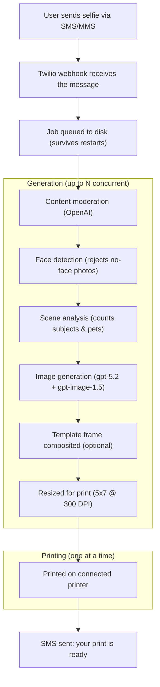

# Twilio + AI Photo Generator

A photobooth-style app powered by Twilio and OpenAI. Attendees text a selfie to a Twilio phone number, choose an art style, and get a printed portrait at your booth. All configuration is manageable at runtime through a web-based admin UI -- no server restarts needed.

## How It Works



After sending a selfie, users receive a numbered style menu and reply with a number or style name. The bot also responds conversationally to questions via AI (gpt-4o-mini). All SMS messages are fully configurable from the admin Settings panel at runtime.

## Prerequisites

- **Node.js** v18+
- **pnpm** -- install with `npm install -g pnpm` ([docs](https://pnpm.io/installation))
- **Twilio account** with a phone number that has SMS/MMS enabled
- **OpenAI API key** with access to gpt-5.2 and gpt-image-1.5
- **Printer** -- Epson EcoTank ET-8550 recommended, connected via USB/WiFi and registered in CUPS

## Quick Start

### 1. Clone and install

```sh
git clone <your-repo-url>
cd twilio-cartoon-printer
pnpm install
```

### 2. Configure environment

Copy into a `.env` file in the project root:

```sh
# Required
TWILIO_ACCOUNT_SID=your_account_sid
TWILIO_AUTH_TOKEN=your_auth_token
OPENAI_API_KEY=your_openai_key
PRINTER_NAME=your_printer_name
EVENT_NAME=YourEventName

# Optional
ADMIN_PHONES=+1234567890,+0987654321
MAX_PRINTS_PER_USER=2
MAX_CONCURRENT_GENERATION=15
TEMPLATE_FILE=signal_sf.png
VIDEO_FILE=get-started.mp4
TERMS_URL=https://example.com/terms
ENABLE_PRINTING=true
BRAND_PROMPT=
PRINT_SIZE=5x7
PRINT_QUALITY=high
CUSTOM_PRINT_FLAGS=
PROMO_MESSAGE=
```

See [docs/GUIDE.md](docs/GUIDE.md#environment-variables) for a full description of each variable.

### 3. Printer setup

Find your printer name with `lpstat -p` and set `PRINTER_NAME` in `.env`. The app prints through CUPS (built into macOS/Linux) and works with USB, WiFi, Bonjour, or IPP connections. See [docs/GUIDE.md](docs/GUIDE.md#printer-setup) for details.

### 4. Start the server

```sh
pnpm start
```

The server starts on port 3000 by default. Set `PORT` in `.env` to use a different port. The home page opens automatically at `http://localhost:3000`.

### 5. Connect Twilio

Point your Twilio phone number's **Messaging webhook** (POST) to:

```
http://your-server-ip/sms
```

Use [ngrok](https://ngrok.com) if your server isn't publicly accessible: `ngrok http 3000`.

## Docker

```sh
docker build -t twilio-cartoon-printer .
docker run --rm -p 8080:8080 --env-file .env twilio-cartoon-printer
```

Add `PORT=8080` to your `.env` for Docker, then point Twilio to `http://<your-host>:8080/sms`.

## Web UI

| Route | Description |
|---|---|
| `/home` | Admin console -- settings, booth display launcher |
| `/home/video` | Fullscreen looping intro video for booth displays |
| `/home/combo` | Split-screen booth display (intro video + photo book) |
| `/home/break` | "We'll Be Right Back" screen for booth breaks |
| `/photogallery` | Photo book with page-turn animations |
| `/dashboard` | Real-time admin dashboard with metrics and monitoring |
| `/outreach` | Broadcast messaging, raffles, lead capture reports |

## Key Features

- **Style selection menu** -- numbered list sent after selfie, reply by number or name
- **AI smart replies** -- conversational responses to text-only messages via gpt-4o-mini
- **Background selection** -- configurable background options users can choose via SMS, or a default background prompt for all portraits
- **Template frames** -- PNG overlays with transparent windows, auto-detected safe zones
- **Configurable SMS messages** -- every message editable from the Settings panel, with `{variable}` interpolation
- **Lead capture** -- SMS survey (before or after portrait) with configurable fields, toggles, and CSV export
- **NPS survey** -- 1-5 rating after last portrait, with dashboard stats and PDF report integration
- **BRB screen** -- "We'll Be Right Back" overlay on all booth displays, toggled via a button
- **Social sharing** -- optional X/Twitter and LinkedIn share links appended to delivery messages
- **Per-event settings** -- save and restore complete settings profiles (styles, brand refs, prompts, messages) per event
- **Runtime settings** -- all config changeable from `/home` without restarts
- **Dashboard** -- job health, failure breakdown, queue status, NPS scores, stuck job alerts, paper counter, PDF reports
- **Outreach** -- broadcast SMS, animated raffle draws, lead reports
- **Photo book** -- realistic page-turn gallery for booth displays
- **Crash recovery** -- file-based queue survives server restarts, auto-retries failed jobs

For detailed documentation on all features, see **[docs/GUIDE.md](docs/GUIDE.md)**.
