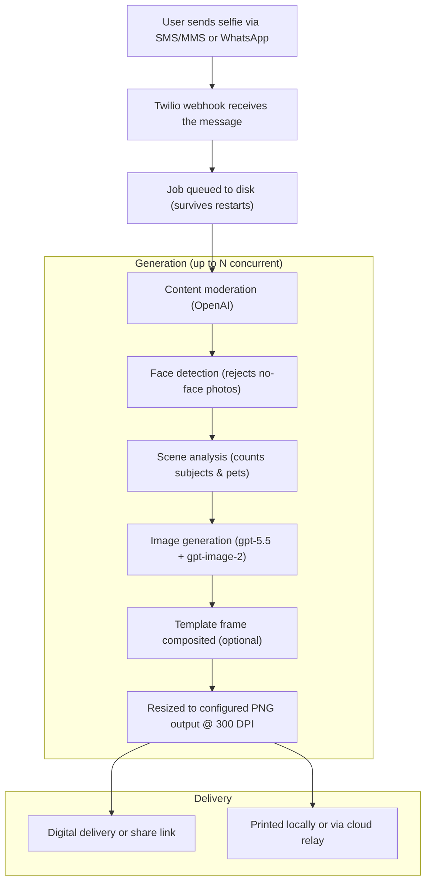

# Twilio + AI Photo Generator

[](https://github.com/anthonyjdella/twilio-cartoon-printer/actions/workflows/ci.yml)
[](https://github.com/anthonyjdella/twilio-cartoon-printer/actions/workflows/deploy.yml)
[](https://github.com/anthonyjdella/twilio-cartoon-printer/actions/workflows/relay-release.yml)
[](#license)

A photobooth-style app powered by Twilio and OpenAI. Attendees send a selfie by SMS/MMS or WhatsApp, choose an art style, and receive a printed portrait, a digital copy, or a share link depending on the event settings. Configuration is manageable at runtime through an OAuth-protected web admin UI -- no server restarts needed.

## How It Works


```mermaid
flowchart TB
  U["User sends selfie via SMS/MMS or WhatsApp"] --> T["Twilio webhook receives the message"]
  T --> Q["Job queued to disk (survives restarts)"]

  subgraph G["Generation (up to N concurrent)"]
    M["Content moderation (OpenAI)"]
    F["Face detection (rejects no-face photos)"]
    A["Scene analysis (counts subjects & pets)"]
    I["Image generation (gpt-5.5 + gpt-image-2)"]
    C["Template frame composited (optional)"]
    R["Resized to configured PNG output @ 300 DPI"]
    M --> F --> A --> I --> C --> R
  end

  Q --> M

  subgraph P["Delivery"]
    P1["Digital delivery or share link"]
    P2["Printed locally or via cloud relay"]
  end

  R --> P1
  R --> P2
```

After sending a selfie, users usually receive a numbered style menu and reply with a number or style name. If only one style is active, or the caption already names a known style, the menu is skipped. The bot can also respond conversationally to questions with AI. All user-facing SMS copy is configurable from the admin Settings panel at runtime.

## Resources

- 📓 **[NotebookLM walkthrough](https://notebooklm.google.com/notebook/01d7b255-12fb-4936-9f50-44d7047b4da4)** — interactive notebook with deep-dive details, architecture overviews, and a chat interface you can ask questions about the project.
- 📖 [Detailed Guide](docs/GUIDE.md) — full feature reference and configuration walkthrough.
- 🛠 [Builder Guide](docs/BUILDER-GUIDE.md) — architecture, design decisions, and FAQ.

## Deployment Options

| Mode | Server runs | Printer | Best for |
|------|------------|---------|----------|
| **Local** | On your laptop | USB/WiFi connected directly | Simple booth setup |
| **Cloud (digital only)** | Cloud (Azure, Docker, etc.) | None needed | Remote/virtual events |
| **Cloud + Print Station app** | Cloud | Local laptop at event | Large events, persistent data |

See [Installation](#installation), [Usage](#usage), and [Cloud Deployment](#cloud-deployment) for setup paths.

## Prerequisites

- **Node.js** 22+
- **pnpm** -- install with `npm install -g pnpm` ([docs](https://pnpm.io/installation))
- **Twilio account** with an SMS/MMS sender, a Messaging Service, or a WhatsApp sender
- **OpenAI API key** with access to the configured text and image models (`gpt-5.5`, `gpt-5.4-nano`, and `gpt-image-2-2026-04-21` by default)
- **Google OAuth client** for the admin UI (`/home`, `/dashboard`, `/outreach`, and settings APIs)
- **Printer** (optional) -- Epson EcoTank ET-8550 recommended, connected via USB/WiFi and registered in CUPS

## Installation

### 1. Clone and install

```sh
git clone <your-repo-url>
cd twilio-cartoon-printer
pnpm install
```

## Configuration

### 1. Configure environment

Copy `.env.example` to `.env` and fill in your credentials:

```sh
cp .env.example .env
```

At minimum, you need:

```sh
TWILIO_ACCOUNT_SID=your_account_sid
TWILIO_AUTH_TOKEN=your_auth_token
TWILIO_MESSAGING_SERVICE_SID=your_messaging_service_sid
OPENAI_API_KEY=your_openai_key
EVENT_NAME=YourEventName
```

Configure at least one sender using `TWILIO_PHONE_NUMBER`, `TWILIO_MESSAGING_SERVICE_SID`, `TWILIO_WHATSAPP_NUMBER`, or `TWILIO_WHATSAPP_MESSAGING_SERVICE_SID`. The app exits at startup if no SMS or WhatsApp sender is configured.

Admin pages require Google OAuth, a shared admin PIN, or both. For local Google access, create a Google OAuth web client and add `http://localhost:3000/auth/callback` as a redirect URI:

```sh
GOOGLE_CLIENT_ID=your-client-id.apps.googleusercontent.com
GOOGLE_CLIENT_SECRET=your-client-secret
SESSION_SECRET=replace-with-at-least-32-random-characters
```

By default, sign-in is limited to verified `@twilio.com` Google accounts. Add `ALLOWED_EMAILS=person@example.com,other@example.com` for non-Twilio operators.

Alternatively, set `ADMIN_PIN` to a case-sensitive 8-64 character value containing only ASCII letters and numbers. Numeric-only values are allowed. PIN and Google logins use the same signed `HttpOnly` session cookie; changing `ADMIN_PIN` immediately invalidates PIN sessions without affecting Google sessions. Store both `ADMIN_PIN` and `SESSION_SECRET` as secrets.

Production requires `SESSION_SECRET` to be at least 32 characters and refuses to start if it is missing or shorter. Local and test runs generate an ephemeral secret when it is omitted.

All other values have defaults. See [docs/GUIDE.md](docs/GUIDE.md#environment-variables) for the full variable reference.

## Usage

### 1. Start the server

```sh
pnpm start
```

The server starts on port 3000 in local development. The home page is available at `http://localhost:3000`, but protected admin pages return `503` until Google OAuth or `ADMIN_PIN` is configured.

### 2. Connect Twilio

Point your Twilio phone number's **Messaging webhook** (POST) to your server:

```
https://your-server/inbound
```

**For local development**, use [ngrok](https://ngrok.com) to expose your server:

```sh
ngrok http 3000
```

Copy the ngrok URL (e.g. `https://abc123.ngrok.io`) and set it as your Twilio webhook: `https://abc123.ngrok.io/inbound`

### 3. Test it

Text a selfie to your Twilio phone number or WhatsApp sender. You should receive a style menu unless the event has only one active style, then get a digital portrait, print job, or share link based on the delivery settings.

## Printer Setup

To enable printing, set delivery mode to **Print + Digital** in the admin Settings panel or set `ENABLE_PRINTING=true`. You also need a CUPS-compatible printer connected to the machine running the server, or to the print relay laptop for cloud deployments. See [Print Relay](#print-relay-cloud-printing).

```sh
# Find your printer name
lpstat -p
```

Set your printer name in the admin Settings panel under **Delivery & Display**, or in `.env`:

```sh
PRINTER_NAME=EPSON_ET_8550_Series
```

The app has built-in print profiles for the **Epson EcoTank ET-8550** and **DNP DS-RX1**. The DS-RX1 profile is selected automatically from its CUPS queue name; set Print Size to **4x6** when 6x4 media is loaded. Other printers may need custom print flags. See [docs/GUIDE.md](docs/GUIDE.md#printer-setup) for details.

> **Install the printer driver first.** A connected printer won't appear in `lpstat -p` (or the Relay app's printer list) until its driver is installed and a CUPS queue exists. For the Epson ET-8550, download the macOS driver from [Epson's support page](https://epson.com/Support/Printers/All-In-Ones/ET-Series/Epson-ET-8550/s/SPT_C11CJ21201), then add the printer in **System Settings > Printers & Scanners** (or via `lpadmin`). Re-run `lpstat -p` to confirm it shows as `idle`/`enabled`.

## CI/CD

Every PR runs lint-free unit tests, a `/healthz` server smoke test, relay-app
install/syntax checks, and a gitleaks secret scan, aggregated into a `Validate`
check; merges to `main` re-run that suite as a gate before deploying. Dependabot
keeps dependencies patched with auto-merge for minor/patch updates. See
[docs/CICD.md](docs/CICD.md) for the full pipeline.

## Cloud Deployment

The app runs in any Docker-compatible cloud platform. The examples below use Azure Container Apps, but the same approach works with AWS ECS, Google Cloud Run, Railway, Fly.io, etc.

### Docker

```sh
docker build -t twilio-cartoon-printer .
docker run --rm -p 8080:8080 --env-file .env twilio-cartoon-printer
```

The container listens on port 8080 by default (`PORT=8080` is set in the Dockerfile).

### Persistent storage

Without persistent storage, all data (settings, jobs, downloads, leads) is lost when the container restarts. To persist data, mount a volume at `/app/appdata`:

```sh
docker run --rm -p 8080:8080 --env-file .env \
  -v /path/to/storage:/app/appdata \
  twilio-cartoon-printer
```

The startup script (`scripts/start.sh`) automatically symlinks runtime-mutable directories to the mount: `data/`, `queue/`, `downloads/`, `templates/`, `brand-references/`, `style-references/`, `background-references/`, and `booth-uploads/`. The shipped `assets/` directory is intentionally not persisted so CSS, fonts, and baked-in media update with each image deploy. Set `DATA_MOUNT` to customize the mount path (defaults to `/app/appdata`).

On **Azure Container Apps**, use an Azure Files volume mount pointed at `/app/appdata`.

### Twilio webhook for cloud

Point your Twilio phone number's webhook to your cloud URL:

```
https://your-cloud-app.example.com/inbound
```

No ngrok needed -- the cloud app is already publicly accessible.

### Digital-only mode

If you don't need printing, use **Digital Only** mode. Portraits are delivered via MMS or share link directly. No printer or relay is needed.

Set delivery mode to **Digital Only** in the Settings panel, or:

```sh
ENABLE_PRINTING=false
```

## Print Relay (Cloud Printing)

When the app runs in the cloud but you need physical printing at an event, the **print relay** bridges them. The cloud app queues print jobs; a lightweight agent on the event laptop polls for jobs, downloads images, and prints locally.

### How it works

```
Cloud App (Azure/Docker)          Event Laptop
┌─────────────────────┐          ┌──────────────────────┐
│  Twilio webhook      │          │  Print Station app    │
│  AI generation       │  poll    │  (or pnpm relay CLI)  │
│  Job queue (ready/)  │ ◄────── │  ↓                    │
│  Relay API           │ ──────► │  Download & print     │
│  MMS delivery        │ complete│  via CUPS             │
└─────────────────────┘          └──────────────────────┘
```

### Step 1: Enable cloud relay printing

Open the admin Settings panel on the cloud app. Under **Delivery & Display**, set delivery mode to **Print + Digital** and enter a strong, unique **Print Relay Key** (for example, generate one with `openssl rand -hex 32`). Save.

`PRINT_RELAY_KEY` enables the relay API and authenticates relay agents. `ENABLE_PRINTING=true` is what causes generated jobs to enter `queue/ready/` for printing. If printing is disabled, completed jobs go digital-only and the relay has nothing to claim.

### Step 2: Run the relay on the event laptop

There are two ways to run the relay. **The Print Station app is recommended** for event staff.

#### Option A: Print Station App (Recommended)

The Print Station is a desktop app with a visual interface for managing printing. No terminal required -- event staff click **Edit** to enter the Cloud URL and Relay Key, select one or more printers from the checklist, and click **Connect**. New installations do not include default credentials. When multiple printers are selected, jobs are distributed automatically across them.

```sh
cd relay-app
npm install
npm start
```

The app shows live status indicators (cloud connection, printer health, job count), a job history list, and a debug log. Configuration is saved between launches.

To build a standalone `.app` bundle you can hand to event staff (no Node.js required):

```sh
cd relay-app
npm run make
# Output: out/make/Twilio Print Station <version> (start here).zip
```

Hand event staff the **`(start here)`** zip. It includes the `.app`, `READ ME FIRST.txt`, and a first-run `Open Twilio Print Station.command` helper for macOS Gatekeeper.

See **[relay-app/README.md](relay-app/README.md)** for full documentation.

#### Option B: CLI Relay

For developers or automated setups, the CLI relay runs in the terminal:

```sh
# Clone the repo (or copy just the scripts/ folder)
git clone <your-repo-url>
cd twilio-cartoon-printer
pnpm install
```

Create a `.env` file with:

```sh
PRINT_RELAY_URL=https://your-cloud-app.example.com
PRINT_RELAY_KEY=<same-random-secret-configured-in-the-cloud-app>
```

`ENABLE_PRINTING=true` must be set on the cloud app, not just on the relay laptop.

Start the relay:

```sh
pnpm relay
```

You should see:

```
[10:30:00 PM] Print Relay Agent starting...
[10:30:00 PM]   Cloud URL: https://your-cloud-app.example.com
[10:30:00 PM]   Poll interval: 5s
[10:30:00 PM]   Dry run: false
[10:30:01 PM] Connected to cloud app (printing: true, size: 5x7, quality: high)
[10:30:01 PM] Printer found: EPSON_ET_8550_Series
[10:30:01 PM] Polling for print jobs...
```

The relay polls the cloud every 5 seconds. When a portrait finishes generating, the relay claims it, downloads the image, prints it, and reports back. By default the user receives the digital portrait immediately after generation; print completion suppresses duplicate MMS. If immediate digital delivery is disabled, the completion MMS waits until the relay reports success.

### CLI relay options

```sh
pnpm relay                                       # Uses .env settings
pnpm relay --dry-run                             # Download images but don't actually print
pnpm relay --printer MyPrinter                   # Override auto-detected printer
pnpm relay --printers "PrinterA,PrinterB"        # Use multiple printers
pnpm relay --interval 2                          # Poll every 2 seconds instead of 5
```

Or set these in `.env`:

```sh
PRINT_RELAY_PRINTER=EPSON_ET_8550_Series          # Single printer
PRINT_RELAY_PRINTERS=EPSON_ET_8550,EPSON_ET_2850  # Multiple printers (comma-separated)
PRINT_RELAY_INTERVAL=5
PRINT_RELAY_DRY_RUN=true
```

**Multi-printer mode:** When `--printers` or `PRINT_RELAY_PRINTERS` is set, the relay spawns one worker per printer. Each worker independently polls for jobs, and the server's atomic job claiming ensures each job goes to exactly one printer. Whichever printer finishes first grabs the next job. If neither flag is set, the relay auto-detects all healthy printers and creates a worker for each.

### Relay features

Both the Print Station app and CLI relay share these capabilities:

- **Auto-reconnects** -- if the cloud app or network drops, the relay keeps polling and reconnects automatically
- **Crash recovery** -- Print Station v1.1+ heartbeats the cloud every 20s while holding a job; if beats stop for >60s after the first heartbeat, the cloud re-queues the job. A crash before the first heartbeat falls back to the 15-minute `printingAt`-age threshold used by older relays.
- **Multi-printer** -- select multiple printers (Print Station) or use `--printers` (CLI) to distribute jobs across printers automatically
- **Race-safe** -- multiple relay agents can run with the same key; only one claims each job
- **Printer error detection** -- detects offline/stopped printers and fails fast instead of hanging
- **Failed printer avoidance** -- jobs that fail on one printer are routed to a different printer on retry; the relay API filters by `failedPrinters` so each relay only sees jobs it hasn't already failed
- **Printer targeting** -- operators can direct a job to a specific printer from the dashboard; the relay API filters by `targetPrinter` so only the correct relay claims it
- **Relay printer tracking** -- relay printers self-register when they poll, making them visible in the cloud dashboard for disable/enable/targeting even though the server has no local CUPS
- **Stale target auto-clear** -- if a relay printer goes offline for 2+ minutes, jobs targeted to it are automatically released to any available printer
- **Graceful shutdown** -- Ctrl+C (CLI) or close window (app) stops cleanly

## Web UI

| Route | Description |
|---|---|
| `/home` | Admin console -- settings, booth display launcher |
| `/home/video` | Fullscreen looping intro video for booth displays |
| `/home/panel` | Static instruction page with QR code, steps, and Twilio branding |
| `/home/combo` | Split-screen booth display (video or static page + photo book) |
| `/home/break` | "We'll Be Right Back" screen for booth breaks |
| `/photogallery` | Photo book with page-turn animations |
| `/dashboard` | Real-time admin dashboard with metrics and monitoring |
| `/outreach` | Broadcast messaging, raffles, lead capture reports |
| `/s/:id` | Shareable portrait page with OG meta tags and social share buttons |
| `/auth/*` | Google OAuth login/callback/logout routes |
| `/review/*` | Mobile review flow and review-token routes |
| `/api/generate` | Programmatic/kiosk generation API |
| `/kiosk` | Browser-based kiosk submission surface |
| `/eval` | Prompt experiment and evaluation tools |
| `/api/print-relay/*` | Relay polling, claim, heartbeat, image download, completion, and reprint API |
| `/healthz` | Lightweight health check for CI and cloud probes |

## Key Features

- **Review modes** -- portraits can be delivered automatically (`off`), held for human approval (`human`, with multi-variant side-by-side picking and per-variant regen), or auto-reviewed by an LLM (`ai`, best-of-N picker). See [Review Modes](docs/GUIDE.md#review-modes).
- **Style selection menu** -- numbered list sent after selfie, reply by number or name
- **Brand selection menu** -- optional SMS menu for choosing a brand/team (e.g. LA Kings, Chelsea FC), each with its own reference images and brand prompt
- **AI smart replies** -- conversational responses to text-only messages
- **Background selection** -- configurable background options users can choose via SMS
- **Template frames** -- PNG overlays with transparent windows, auto-detected safe zones
- **Configurable SMS messages** -- every message editable from the Settings panel, with `{variable}` interpolation
- **Lead capture** -- SMS survey (before or after portrait) with configurable fields, toggles, and CSV export
- **NPS survey** -- 1-5 rating after last portrait, with dashboard stats and PDF report integration
- **Booth display modes** -- video (looping intro), static instruction page (QR code + steps with Twilio branding), or none (photo book only)
- **BRB screen** -- "We'll Be Right Back" overlay on all booth displays
- **Social sharing** -- branded share page with OG meta tags, per-platform share buttons (X/Twitter, LinkedIn, Instagram), dub.co URL shortening with custom domains, personalized titles via lead capture data
- **Import style prompts** -- copy style prompt overrides from one event to another
- **Per-event settings** -- save and restore complete settings profiles per event
- **Runtime settings** -- all config changeable from `/home` without restarts
- **Dashboard** -- job health, failure breakdown, combined jobs panel (failed + completed with filter tabs), queue status, NPS scores, stuck job alerts, PDF reports
- **Outreach** -- broadcast SMS, animated raffle draws, lead reports
- **Photo book** -- realistic page-turn gallery for booth displays
- **Immediate digital delivery** -- in Print + Digital mode, users get their portrait via SMS immediately after generation instead of waiting for the print to finish
- **Printer failure resilience** -- jobs track which printers failed them and smart dispatch routes retries to different printers; operators can disable/enable printers from the dashboard (works for both local and relay printers)
- **Printer targeting** -- retry or reprint a job to a specific printer from the dashboard; relay printers are auto-discovered from check-ins
- **Reprint completed jobs** -- reprint any completed portrait from the dashboard with optional printer targeting (no SMS sent, no usage quota impact)
- **Dashboard printer warnings** -- alerts when jobs are waiting but no printers are connected or all printers are disabled
- **Crash recovery** -- file-based queue survives server restarts, auto-retries failed jobs
- **Print relay** -- cloud-to-local printing via polling agent for cloud deployments

For detailed documentation on all features, see **[docs/GUIDE.md](docs/GUIDE.md)**. To understand how the app is designed and built (tech stack, architecture, decisions, FAQ), see **[docs/BUILDER-GUIDE.md](docs/BUILDER-GUIDE.md)**.

## Style × Brand × Background combos (per-event config)

Each event can configure nine art styles × five brand wardrobes × a contextual set of backgrounds. The background menu is assembled at runtime from the chosen style and brand — no static list per event. See `docs/superpowers/specs/2026-04-24-style-brand-background-combos-design.md` for the full design.

### Custom style fields

- `behavior` — `"normal"` (default) or `"themed-container"`. Use `themed-container` when the style wraps the subject in a physical object like a toy box or trading card, whose interior/art themes to the chosen background.
- `acceptsColorPalette` — boolean (default `true`). Set to `false` on material-defined styles (e.g., bronze sculpture) so a brand's color palette override does not recolor them.
- `containerDescription` — string, required when `behavior === "themed-container"`.

### Custom brand fields

- `category` — `"wardrobe-only"` (default) or `"wardrobe-plus-scene"`.
- `wardrobe` — prompt fragment describing clothing/accessories.
- `scenes` — array of `{ key, name, prompt, files? }`. Wardrobe-only brands typically define one scene; wardrobe-plus-scene brands define at least two.
- `allowOriginal` — boolean (default `true`). Set to `false` to hide the "Original scene" option (appropriate for brands that force a themed scene).
- `colorPalette` — optional prompt fragment. When set, applied as a final recoloring instruction unless the chosen style sets `acceptsColorPalette: false`.

Users now see a "None" option at the bottom of the brand menu so they can skip the brand layer entirely.

## License

ISC. See `package.json`.
